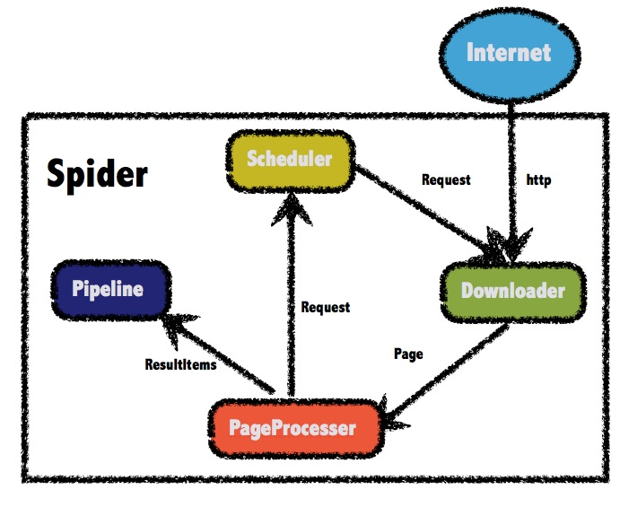
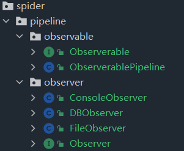

## guide

- 本篇代码位置 **com.engure.spider.demo** ，是仿照牛客网提供的代码 **com.engure.spider.service**

## contents

- [webmagic](#webmagic)
- [webmagic 示例程序](#webmagic-示例程序)
- [webmagic 扩展](#webmagic-扩展)

## webmagic

参考：
- [webmagic中文官方文档](http://webmagic.io/docs/zh/)
- [webmagic的使用学习 - 会飞的大野鸡 - 博客园 (cnblogs.com)](https://www.cnblogs.com/B-rabbit/p/13781986.html)

### 概述

webmagic是一个开源的Java垂直爬虫框架，目标是简化爬虫的开发流程，让开发者专注于逻辑功能的开发
WebMagic项目代码分为核心和扩展两部分：

- 核心部分(webmagic-core)是一个精简的、模块化的爬虫实现，而扩展部分则包括一些便利的、实用性的功能。WebMagic的架构设计参照了Scrapy，目标是尽量的模块化，并体现爬虫的功能特点。这部分提供非常简单、灵活的API，在基本不改变开发模式的情况下，编写一个爬虫
- 扩展部分(webmagic-extension)提供一些便捷的功能，例如注解模式编写爬虫等。同时内置了一些常用的组件，便于爬虫开发

### 设计原理

WebMagic 的结构分为 Downloader、PageProcessor、Scheduler、Pipeline 四大组件，并由 Spider 将它们彼此组织起来。
WebMagic 总体架构图如下：



### WebMagic的四个组件

- Downloader：**Downloader负责从互联网上下载页面，以便后续处理**。WebMagic默认使用了Apache HttpClient作为下载工具。
- PageProcessor：**PageProcessor负责解析页面，抽取有用信息，以及发现新的链接**。WebMagic使用Jsoup作为HTML解析工具，并基于其开发了解析XPath的工具Xsoup。在这四个组件中，PageProcessor对于每个站点每个页面都不一样，是需要使用者定制的部分。
- Scheduler：Scheduler**负责管理待抓取的URL，以及一些去重的工作**。WebMagic默认提供了JDK的内存队列来管理URL，并用集合来进行去重。也支持使用Redis进行分布式管理。除非项目有一些特殊的分布式需求，否则无需自己定制Scheduler。
- Pipeline：Pipeline**负责抽取结果的处理，包括计算、持久化到文件、数据库等**。WebMagic默认提供了“输出到控制台”和“保存到文件”两种结果处理方案。Pipeline定义了结果保存的方式，如果你要保存到指定数据库，则需要编写对应的Pipeline。对于一类需求一般只需编写一个Pipeline。

### 用于数据流转的对象

- Request：Request是对URL地址的一层封装，一个Request对应一个URL地址。它是PageProcessor与Downloader交互的载体，也是PageProcessor控制Downloader唯一方式。除了URL本身外，它还包含一个Key-Value结构的字段extra。你可以在extra中保存一些特殊的属性，然后在其他地方读取，以完成不同的功能。例如附加上一个页面的一些信息等。
- Page：Page代表了从Downloader下载到的一个页面——可能是HTML，也可能是 **JSON** 或者其他文本格式的内容。Page是WebMagic抽取过程的核心对象，它提供一些方法可供抽取、结果保存等。
- **ResultItems**：ResultItems 相当于一个Map，它**保存PageProcessor处理的结果，供Pipeline使用**。它的API与Map很类似，值得注意的是它有一个字段skip，若设置为true，则不应被Pipeline处理。


## webmagic 示例程序

```java
/**
 * webmagic 官方示例程序
 */
public class GithubRepoPageProcessor implements PageProcessor {

    private Site site = Site.me().setRetryTimes(3).setSleepTime(100);

    @Override
    public void process(Page page) {
        //添加新网址 github.com/username/reponame
        page.addTargetRequests(page.getHtml().links().regex("(https://github\\.com/\\w+/\\w+)").all());

        //提取页面数据
        page.putField("author", page.getUrl().regex("https://github\\.com/(\\w+)/.*").toString());
        page.putField("name", page.getHtml().xpath("//h1[@class='entry-title public']/strong/a/text()").toString());
        page.putField("readme", page.getHtml().xpath("//div[@id='readme']/tidyText()"));
        if (page.getResultItems().get("name") == null) {
            //pipeline不处理这个页面
            page.setSkip(true);
        }
    }

    @Override
    public Site getSite() {
        return site;
    }

    public static void main(String[] args) {
        Spider.create(new GithubRepoPageProcessor())
                .addPipeline(new ConsolePipeline())
                .addUrl("https://github.com/code4craft").thread(5).run();
    }
}
```


## webmagic 扩展

### 策略模式拓展页面处理

> 
>
> Context类
>
> ```java
> public class Context {
>    private Strategy strategy;
>  
>    public Context(Strategy strategy){
>       this.strategy = strategy;
>    }
>  
>    public int executeStrategy(int num1, int num2){
>       return strategy.doOperation(num1, num2);
>    }
> }
> ```

定义策略接口，实现策略模式，扩展页面处理方法

将页面处理接口 `PageProcess.process(Page page)` 从具体实现中剥离出来

```java
/**
 * 页面处理策略总接口
 */
public interface PageProcessStrategy {
    /**
     * 页面处理接口
     *
     * @param page
     */
    void doProcess(Page page);
}
```

图书列表页信息处理

```java
public class BookNavPageProcessStrategy implements PageProcessStrategy {

    /**
     * 提取图书信息导航页信息，比如 https://book.douban.com/tag/互连网?start=40&type=T
     *
     * @param page
     */
    @Override
    public void doProcess(Page page) {

        // 图书标签页
        List<String> titles = page.getHtml().xpath("//*[@id=\"subject_list\"]/ul/li/div[2]/h2/a/@title").all();
        List<String> details = page.getHtml().xpath("//*[@id=\"subject_list\"]/ul/li/div[2]/div[1]/text()").all();
        List<String> desps = page.getHtml().xpath("//*[@id=\"subject_list\"]/ul/li/div[2]/p/text()").all();
        List<String> hrefs = page.getHtml().xpath("//*[@id=\"subject_list\"]/ul/li/div[2]/h2/a/@href").all();

        List<Book0> bookList = new ArrayList<>();
        try {
            for (int i = 0; i < titles.size(); i++) {
                //写入每本书都都有的信息
                bookList.add(new Book0(titles.get(i), details.get(i), desps.get(i), hrefs.get(i)));
                //留一手，避免数据错乱，数据越界
            }
            page.putField("data", bookList);
        } catch (Exception e) {
            page.setSkip(true);
            throw new RuntimeException("信息数量不一致，拒绝写入！");
        }
    }


}
```


### 装饰器模式拓展单页处理

> 
>
> 被装饰类、伪实现类 ShapeDecorator
>
> ```java
> public abstract class ShapeDecorator implements Shape {
> protected Shape decoratedShape;
> 
> public ShapeDecorator(Shape decoratedShape){
>    this.decoratedShape = decoratedShape;
> }
> 
> public void draw(){
>    decoratedShape.draw();
> }  
> }
> ```
>
> 装饰器类 RedShapeDecorator
>
> ```java
> public class RedShapeDecorator extends ShapeDecorator {
> 
> public RedShapeDecorator(Shape decoratedShape) {
>    super(decoratedShape);     
> }
> 
> @Override
> public void draw() {
>    decoratedShape.draw();         
>    setRedBorder(decoratedShape);
> }
> 
> private void setRedBorder(Shape decoratedShape){
>    System.out.println("Border Color: Red");
> }
> }
> ```
>

> 装饰器模式（Decorator Pattern）：允许向一个现有的对象添加新的功能，同时又不改变其结构。
>
> 这种模式创建了一个装饰类，用来**包装**原有的类，并在保持类方法签名完整性的前提下，提供了额外的功能。
>
> 一般的，我们为了**扩展一个类**经常使用**继承**方式实现，由于继承为类引入静态特征，并且随着扩展功能的增多，子类会很膨胀。
>
> 装饰类和被装饰类可以独立发展，不会相互耦合，装饰模式是继承的一个替代模式，装饰模式可以**动态扩展**一个实现类的**功能**。

在策略模式中实现了单个页面的爬取，爬虫往往不会爬取单一页面往往是根据一个页面或者某种规则进行迭代爬取，此时在 单个页面爬取策略上进行修改是不妥的，因为违背了开闭原则

在单个页面爬取策略的基础上进行拓展，使用装饰器模式设计迭代爬取策略：

设计伪实现类（装饰类、包装类）DecoratorPageProcessorStrategy：什么都没干，真正的装饰器类需要继承这个类并自己实现

```java
public class DecoratorPageProcessStrategy implements PageProcessStrategy {

    private PageProcessStrategy pageProcessStrategy;

    //指定策略
    public DecoratorPageProcessStrategy(PageProcessStrategy pageProcessStrategy) {
        this.pageProcessStrategy = pageProcessStrategy;
    }

    //“最顶层”的页面处理
    @Override
    public void doProcess(Page page) {
        pageProcessStrategy.doProcess(page);
    }
}
```

设计装饰器类（装饰者）IteratorPageProcessStrategy

```java
public class IteratorPageProcessStrategy extends DecoratorPageProcessStrategy {

    //默认单页爬取策略
    public IteratorPageProcessStrategy() {
        super(new BookNavPageProcessStrategy());
    }

    //指定爬取策略
    public IteratorPageProcessStrategy(PageProcessStrategy pageProcessStrategy) {
        super(pageProcessStrategy);
    }

    /**
     * 迭代爬取实现，对不同页面进行不同的爬取操作。
     * 对原有的单页处理做拓展。
     *
     * @param page
     */
    @Override
    public void doProcess(Page page) {
        String url = page.getRequest().getUrl();
        if (url.startsWith("https://book.douban.com/tag/")) {
            //单页爬取
            super.doProcess(page);
        } else if (url.startsWith("https://book.douban.com/subject/[0-9]+")) {
            //跳过此页的数据处理
            page.setSkip(true);
        }
    }
}
```

装饰器进一步使用：:memo:


> 当然，网页的结构可能有很多层，往往需要进入好几层（列表页、详情页、评论页等），才能真正找到需要的数据页面，你可以延续这个思路，**在  IteratorPageProcessStrategy 外面再加几层装饰，完成多层次的爬取工作，每一层只用专注于当前层次的网页的爬取和信息收集工作。**


### 观察者模式拓展 pipeline

pipeline 简单使用

```java
class MyPipeLine implements Pipeline {

    @Override
    public void process(ResultItems resultItems, Task task) {
        System.out.println("----------------------------------");
        System.out.println("allAttr = " + resultItems.getAll());
        Site site = task.getSite();
        System.out.println("uuid = " + task.getUUID());
        System.out.println("domain = " + site.getDomain());
        System.out.println("cookies = " + site.getAllCookies());
        System.out.println("headers = " + site.getHeaders());
        System.out.println("==================================");
    }
}
```

思考：

1. **怎么理解 pipeline 的数据处理？**

pipeline 调用 process 方法获取数据，需要对数据进一步处理（加工、检错、包装等），然后将数据写入磁盘（包括文件、数据库等载体）

2. **直接继承 pipeline 接口？这样有什么问题？**

不同的 pipeline 都要进行相同数据处理，然后以不同的方式写入磁盘。其中的数据处理部分重复了。

3. **装饰器模式可以吗？**

装饰器模式是做一种非继承方式的功能扩展。不同的 pipeline 的使命是使用不同的方式将数据写入磁盘，与功能拓展关系不大。

4. **怎么做比较好？**

使用观察者模式，pipeline 充当被观察者，不同的数据处理方式充当观察者，当 Pipeline 把结果准备好的时候，主动去推送结果。


定义观察者和被观察者

```java
public interface Observerable {
    void notifyAllObservers(Object data);
    void addObserver(Observer observer);
    void deleteObserver(Observer observer);
}

public interface Observer {
    void update(Object data);
}
```

被观察者充当 pipeline 角色

```java
public class ObserverablePipeline implements Observerable, Pipeline {

    private Vector<Observer> observers = new Vector<>(16);

    @Override
    public void notifyAllObservers(Object data) {
        for (Observer observer : observers) {
            observer.update(data);
        }
    }

    @Override
    public void addObserver(Observer observer) {
        if (!observers.contains(observer))
            observers.add(observer);
    }

    @Override
    public void deleteObserver(Observer observer) {
        observers.removeElement(observer);
    }

    ////////////////////////////////////////////////////////////////////////

    @Override
    public void process(ResultItems resultItems, Task task) {
        //数据处理
        List<Book0> bookList = resultItems.get("data");
        String domain = task.getSite().getDomain();
        Book1 book1 = new Book1(bookList, domain);

        notifyAllObservers(book1);//写入bean
    }

}
```



> com.engure.spider.demo.pipeline 包下是 demo 类
>
> com.engure.spider.demo.spider.pipeline 包下是是观察者模式拓展的 pipeline 类


## 源码分析


### 运行逻辑

```java
//爬虫运行：从调度器中取request，创建任务放在线程池中执行
@Override
public void run() {
    checkRunningStat();
    initComponent();
    logger.info("Spider {} started!",getUUID());
    while (!Thread.currentThread().isInterrupted() && stat.get() == STAT_RUNNING) {
        final Request request = scheduler.poll(this);//从调度器中取请求
        if (request == null) {
            if (threadPool.getThreadAlive() == 0 && exitWhenComplete) {
                break;
            }
            // wait until new url added
            waitNewUrl();
        } else {
            threadPool.execute(new Runnable() {
                @Override
                public void run() {
                    try {
                        processRequest(request);//处理请求
                        onSuccess(request);//爬虫监听，还不知道作什么
                    } catch (Exception e) {
                        onError(request);//爬虫监听，还不知道作什么
                        logger.error("process request " + request + " error", e);
                    } finally {
                        pageCount.incrementAndGet();
                        signalNewUrl();//通知waitNewUrl上等待的线程
                    }
                }
            });
        }
    }
    stat.set(STAT_STOPPED);
    // release some resources
    if (destroyWhenExit) {
        close();
    }
    logger.info("Spider {} closed! {} pages downloaded.", getUUID(), pageCount.get());
}

//下载页面，进行处理
private void processRequest(Request request) {
    Page page = downloader.download(request, this);
    if (page.isDownloadSuccess()){
        onDownloadSuccess(request, page);
    } else {
        onDownloaderFail(request);
    }
}

//页面成功的处理方式
private void onDownloadSuccess(Request request, Page page) {
    if (site.getAcceptStatCode().contains(page.getStatusCode())){
        pageProcessor.process(page);//策略模式，将页面处理抽离出来
        extractAndAddRequests(page, spawnUrl);//抽取page中新加入的request到调度队列中
        if (!page.getResultItems().isSkip()) {//判断page页是否进行数据处理
            for (Pipeline pipeline : pipelines) {
                pipeline.process(page.getResultItems(), this);//策略模式，将数据处理抽离出来
            }
        }
    } else {
        logger.info("page status code error, page {} , code: {}", request.getUrl(), page.getStatusCode());
    }
    sleep(site.getSleepTime());//间隔时间
    return;
}

//等待和重试
private void onDownloaderFail(Request request) {
    if (site.getCycleRetryTimes() == 0) {
        sleep(site.getSleepTime());
    } else {
        // for cycle retry
        doCycleRetry(request);
    }
}

//重试策略，复制request，设置优先级，加入队列
private void doCycleRetry(Request request) {
    Object cycleTriedTimesObject = request.getExtra(Request.CYCLE_TRIED_TIMES);
    if (cycleTriedTimesObject == null) {
        addRequest(SerializationUtils.clone(request).setPriority(0).putExtra(Request.CYCLE_TRIED_TIMES, 1));
    } else {
        int cycleTriedTimes = (Integer) cycleTriedTimesObject;
        cycleTriedTimes++;
        if (cycleTriedTimes < site.getCycleRetryTimes()) {
            addRequest(SerializationUtils.clone(request).setPriority(0).putExtra(Request.CYCLE_TRIED_TIMES, cycleTriedTimes));
        }
    }
    sleep(site.getRetrySleepTime());
}

```


### 爬虫组件

```java
//初始化组件：下载器、pipeline、线程池
protected void initComponent() {
    if (downloader == null) {
        this.downloader = new HttpClientDownloader();
    }
    if (pipelines.isEmpty()) {
        pipelines.add(new ConsolePipeline());
    }
    downloader.setThread(threadNum);
    if (threadPool == null || threadPool.isShutdown()) {
        if (executorService != null && !executorService.isShutdown()) {
            threadPool = new CountableThreadPool(threadNum, executorService);
        } else {
            threadPool = new CountableThreadPool(threadNum);
        }
    }
    if (startRequests != null) {
        for (Request request : startRequests) {
            addRequest(request);
        }
        startRequests.clear();
    }
    startTime = new Date();
}
```


### 调度队列

```java
public class QueueScheduler extends DuplicateRemovedScheduler implements MonitorableScheduler {

    private BlockingQueue<Request> queue = new LinkedBlockingQueue<Request>();

    @Override
    public void pushWhenNoDuplicate(Request request, Task task) {
        queue.add(request);
    }

    @Override
    public Request poll(Task task) {
        return queue.poll();
    }

    @Override
    public int getLeftRequestsCount(Task task) {
        return queue.size();
    }

    @Override
    public int getTotalRequestsCount(Task task) {
        return getDuplicateRemover().getTotalRequestsCount(task);
    }
}
```


### 复杂的爬虫

项目的爬虫爬取的页面较少只有列表页和详情页，当页面有多种类型时，跟能体现出拓展的重要性


爬取图片


